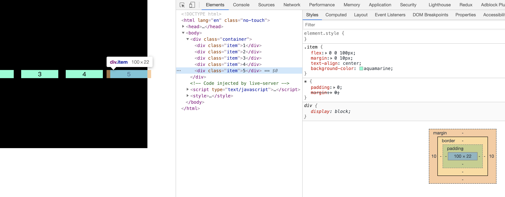
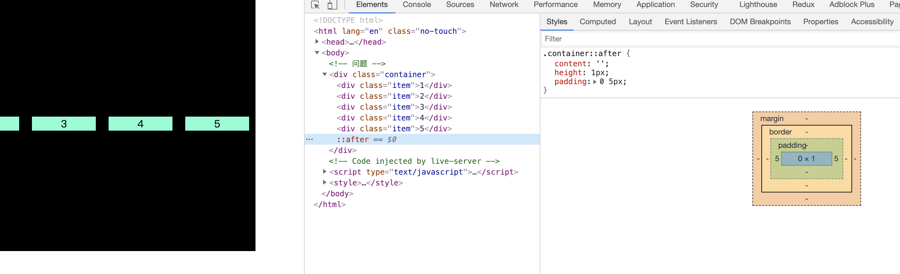

# flex 布局最后子元素 margin-right 失效

## 问题描述

html 结构如下：

```
 <div class="container">
      <div class="item">1</div>
      <div class="item">2</div>
      <div class="item">3</div>
      <div class="item">4</div>
      <div class="item">5</div>
</div>
```

css 样式如下：

```
.container {
        display: flex;
        align-items: center;
        width: 400px;
        height: 400px;
        overflow-x: auto;
        background-color: black;
      }
      .item {
        flex: 0 0 100px;
        margin: 0 10px;
        text-align: center;
        background-color: aquamarine;
      }
```

展示样式如下：


从上图可见，最后一个 div 的右侧 margin 间距没有显示。

## 原因

从上图可见，并不是 margin-right 失效，而是父元素设置的宽度不够，导致对齐的时候没有按照正常方式显示

## 解决方案

- 原理：使用伪元素，在最后子元素后面加一个元素，然后通过设置 padding 或 width 模拟 margin-right
- 代码如下：

```
.container::after {
        content: '';
        height: 1px;
        padding: 0 5px;
      }
      .item:last-child {
        margin-right: 0;
      }
```

- 效果如下：
  
