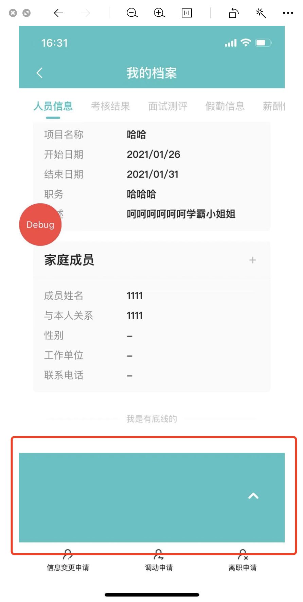

# 如何设置 div 背景色一半为蓝色一半为白色

## 问题

h5 页面，布局为顶部导航栏+内容区域，内容区域高度固定，设置了 overflow:auto 支持滚动加载更多；但在 IOS 上， 滚动区域上拉/下拉时会有一块跟随高度，这时候下拉时背景色会出现断裂，如下图：


## 原因

导航栏背景色和内容区域背景色不一致导致

## 解决方案

- 给内容区域最外层元素指定高度设置背景色，颜色跟导航栏一致
- `注`：如果给整个内容区域设置背景色，上拉加载更多时，背景色会出现断裂，如下图：



使用 css 线性渐变，给内容区域最外层元素指定高度设置背景色，代码如下：

```
background: linear-gradient(to bottom, #13c2c2 0,#13c2c2 275px, white 276px, white 100%);

```

## css 线性渐变说明

https://developer.mozilla.org/zh-CN/docs/Web/Guide/CSS/Using_CSS_gradients
