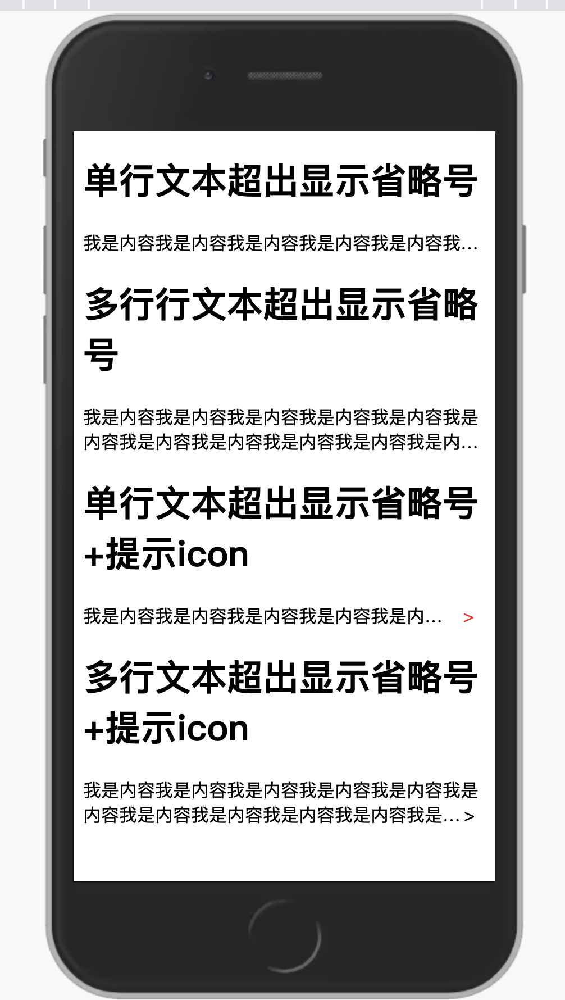

# 单行(多行)文本超出显示省略号

## 场景
* 单行文本超出显示省略号
* 多行文本超出显示省略号
* 单行文本超出显示省略号 + 提示icon
* 多行文本超出显示省略号 + 提示icon

## 实现
### 单行文本超出显示省略号

```
  .one-line {
        width: 100%;
        line-height: 22px;
        overflow: hidden;
        white-space: nowrap;
        text-overflow: ellipsis;
      }

   <div class="one-line">
      我是内容我是内容我是内容我是内容我是内容我是内容我是内容我是内容我是内容我是内容
    </div>   
```

### 多行文本超出显示省略号
```
    .more-line {
        width: 100%;
        line-height: 22px;
        display: -webkit-box;
        /* 两行 */
        -webkit-line-clamp: 2;
        -webkit-box-orient: vertical;
        overflow: hidden;
        word-break: break-all;
      }

    <div class="more-line">
      我是内容我是内容我是内容我是内容我是内容我是内容我是内容我是内容我是内容我是内容我是内容我是内容我是内容我是内容我是内容我是内容
    </div>

```
### 单行文本超出显示省略号 + 提示icon
```
   .one-line-container {
        display: flex;
      }
      .left {
        width: auto;
        overflow: hidden;
        white-space: nowrap;
        text-overflow: ellipsis;
      }
      .right {
        color: red;
        text-align: center;
        width: 100px;
        word-break: break-all;
      }

    <div class="one-line-container">
      <div class="left">
        我是内容我是内容我是内容我是内容我是内容我是内容我是内容我是内容我是内容我是内容我是内容我是内容我是内容我是内容我是内容我是内容
      </div>
      <div class="right">></div>
    </div>
```
### 多行文本超出显示省略号 + 提示icon
```
    .more-line-container {
        position: relative;
        line-height: 22px;
        display: -webkit-box;
        -webkit-line-clamp: 2;
        -webkit-box-orient: vertical;
        overflow: hidden;
        word-break: break-all;
      }
      .more-line-container::before {
        content: '';
        float: right;
        width: 0;
        /* 22：为行高 */
        height: 22px;
      }
      .icon {
        width: 20px;
        float: right;
        clear: both;
        display: none;
      }

    <div class="more-line-container">
      <!-- float布局元素必须在上方 -->
      <span id="icon" class="icon">></span>
      我是内容我是内容我是内容我是内容我是内容我是内容我是内容我是内容我是内容我是内容我是内容我是内容我是内容我是内容我是内容我是内容
    </div>

     <script>
      // 多行文本超出显示省略号+提示icon，处理是否显示icon
      const elem = document.querySelector('.more-line-container');
      // 表示文本超出，会显示省略号
      if (elem.scrollHeight > elem.clientHeight) { 
        // 显示提示icon
        document.getElementById('icon').style.display = 'block';
      }else{
        // 不显示提示icon
        document.getElementById('icon').style.display = 'none';
      }
    </script>

```
## 效果图
