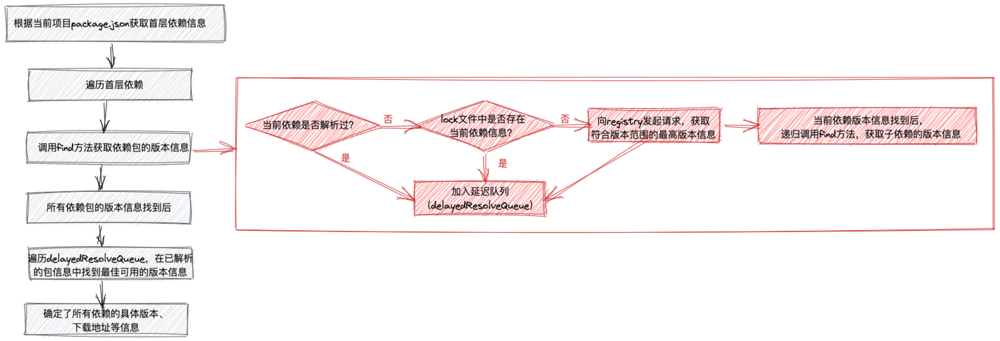
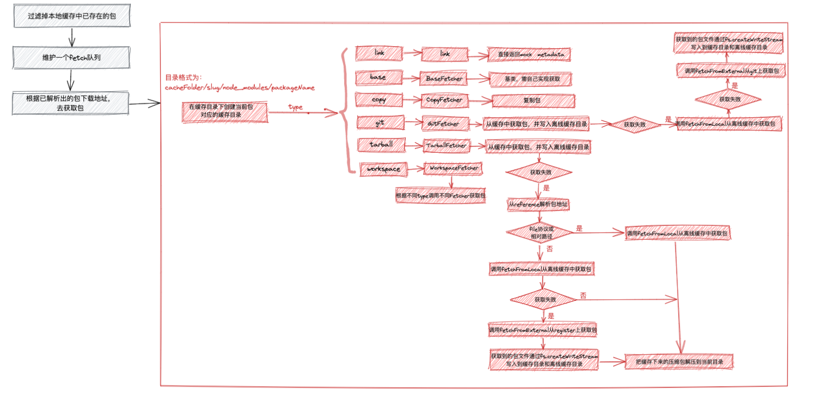
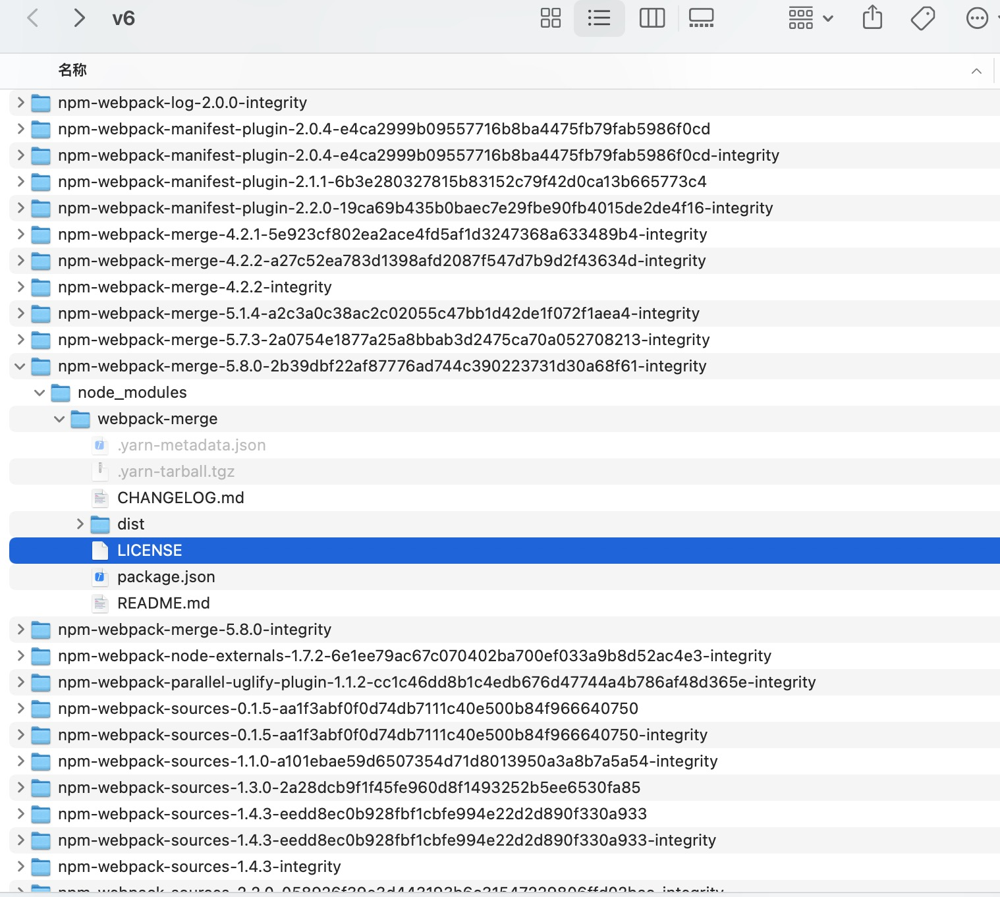
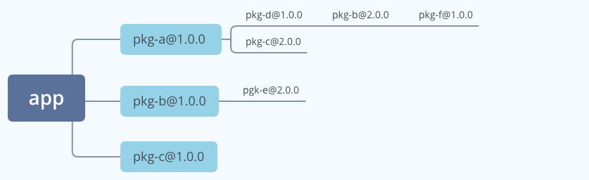
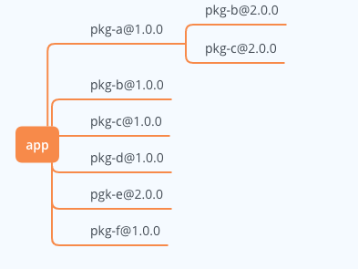

- [yarn install安装依赖过程](#yarn-install安装依赖过程)
  - [前置检查](#前置检查)
  - [检查package.json（validating package.json）](#检查packagejsonvalidating-packagejson)
  - [解析包（resolving packages）](#解析包resolving-packages)
  - [获取包（fetching packages）](#获取包fetching-packages)
  - [链接包（linking packages）](#链接包linking-packages)
  - [构建包（building fresh packages）](#构建包building-fresh-packages)
  - [相关代码](#相关代码)
  - [相关参考](#相关参考)
# yarn install安装依赖过程
**前提：yarn版本为1.22.17**

在项目根目录执行`yarn install`命令，执行结果如下图所示：


通过上图，我们可以知道，`yarn install`安装依赖包括以下几个阶段：
0. 前置检查
1. 检查package.json（validating package.json）
2. 解析包（resolving packages）
3. 获取包（fetching packages）
4. 链接包（linking packages）
5. 构建包（building fresh packages）

## 前置检查
检查内容包括：
1. 检查yarn是否存在新版本
2. 是否存在npm-shrinkwrap.json文件，如果存在给出warning
3. 是否存在package-lock.json文件，如果存在给出warning
4. 如果配置了plugnplayEnabled，其支持建议信息

如果存在npm-shrinkwrap.json或package-lock.json会给出`warning`，为了避免冲突建议移除。

## 检查package.json（validating package.json）
该阶段会根据package.json文件中的os、cpu和engines配置信息，检查环境兼容性。

## 解析包（resolving packages）
该阶段会遍历依赖树，确定每个依赖包的具体版本信息和下载地址等。解析包过程如下图所示：


**步骤说明如下：**
1. 根据当前项目pacakge.json获取首层依赖信息，包括dependencies、devDependencies、optionalDependencies声明的依赖和workspaces中顶级 packages列表，整合后的首层依赖信息是`Array<DependencyRequestPattern>`,类型定义如下： 
    ```
    export type DependencyRequestPattern = {
        // pattern: packageName@packageVersionRange
        pattern: string,
        // registry: npm /install
        registry: RegistryNames,
        // optional：是否为可选依赖（optionalDependencies）
        optional: boolean,
        // hint: 不同类型的依赖，'dev' | 'optional' | 'resolution' | 'workspaces'（devDependencies/optionalDependencies/resolutions/workspaces）
        hint?: ?RequestHint,
        parentNames?: Array<string>,
        parentRequest?: ?PackageRequest,
        // workspaceName： package.json中的name
        workspaceName?: string,
        // workspaceLoc: package.json中的_loc
        workspaceLoc?: string,
    };
    ```
2. 遍历首层依赖，调用`find()`获取依赖包的版本信息，然后递归调用`find()`查找每个依赖下嵌套依赖的版本信息，查找包过程如下：
   1. 根据pattern判断当前package是否解析过，即在`resolutionMap`中是否存在
   2. 如果已经解析过（即resolved），将其加入延迟队列（即delayedResolveQueue）
   3. 如果未解析过，首先从lock文件中获取精确匹配的包版本信息，如果lock文件中存在当前当前依赖包的版本信息，将当前包标记为已解析（即resolved），并将其加入延迟队列（即delayedResolveQueue）；如果不存在，向register发起请求，回去符合版本范围的最高版本信息，将当前包标记为已解析（即resolved），并将其加入延迟队列（即delayedResolveQueue）
3. 当依赖树遍历完成，即所有依赖包的版本信息都找到了，这时候再遍历延迟队列delayedResolveQueue，在已经解析的包信息中找到最佳可用的版本信息

经过resolving packages，所有依赖包的具体版本、下载地址等信息就都确定了。

**[点击这里](https://github.com/yarnpkg/yarn/blob/2d73345615d28f2f2fcd9fc9d39ab2ae89f3b2cb/src/cli/commands/install.js#L595)查看该阶段执行代码**

## 获取包（fetching packages）
该阶段主要是下载缓存中没有的包。获取包过程如下图所示：


**步骤说明如下：**
1. 在缓存中已经存在的包，是不需要下载的，所以过滤掉本地缓存中已经存在的包。如何判断缓存中是否存在该包呢？
   1. 通过`yarn cache dir`命令，可以查看yarn缓存目录（即cacheFolder）
   2. 每个包的缓存是以`{cacheFolder}/{slug}/node_modules/{packageName}`命名的目录形式保存的，其中slug由版本、哈希值和uid组成，所以yarn以平铺的形式存放的缓存包
   3. 判断系统中存在该路径`{cacheFolder}/{slug}/node_modules/{packageName}`，如果存在，说明缓存已存在，不用重新下载，将它过滤掉
   4. 缓存的包列表如下图所示：
        
2. 需要下载的包维护到一个fetch队列中，根据`resolving packages`阶段已解析出的包下载地址，去获取包（支持并行获取和失败自动重试）
3. 获取包之前，会在yarn缓存目录下新建当前包对应的缓存目录
4. 根据不同的类型调用不同的`Fetcher`去获取包。这里以常用的`tarball`类型为例介绍获取包过程：
   1. 先从缓存中获取包，然后写入离线缓存（即离线镜像）对应路径（即配置离线镜像）
   2. 如果本地缓存中不存在，将会解析包的reference地址，如果是file协议开头或相对路径（即属于本地文件系统），将会从离线缓存（即离线镜像）中获取包；否则先尝试从离线缓存中获取包，如果获取失败，再从register上获取包
   3. 将获取的包文件流写入缓存和离线缓存对应目录下
5. 将缓存的`.tgz`压缩包解压到当前目录下

经过 fetching packages，项目所需的依赖都在yarn缓存目录中了

**[点击这里](https://github.com/yarnpkg/yarn/blob/2d73345615d28f2f2fcd9fc9d39ab2ae89f3b2cb/src/cli/commands/install.js#L638)查看该阶段执行代码**

## 链接包（linking packages）
该阶段主要是遵循扁平化原则，将缓存中的依赖复制到当前项目`node_modules`下。主要做了三件事：
1. **解析peerDependencies**：调用`resolvePeerModules`方法解析peerDependencies，如果在已解析的依赖包列表中找不到匹配的peerDependencies，给出warning提示
2. ** 扁平化依赖树**：分析同一依赖包不同版本的使用频率，选择利用率最大的版本放置在顶层。这一过程称为 dedupe。
   1. 项目依赖树如下：
   
   1. 扁平化处理后的依赖如下：
   
3. 根据扁平化后结构，把缓存中对应依赖复制到`node_modules`下。

经过linking packages，项目所需的依赖都在node_modules目录下了。

**[点击这里](https://github.com/yarnpkg/yarn/blob/2d73345615d28f2f2fcd9fc9d39ab2ae89f3b2cb/src/cli/commands/install.js#L658)查看该阶段执行代码**

## 构建包（building fresh packages）
如果依赖包中存在二进制包需要进行编译。在这一阶段会执行`install`相关的生命周期钩子，包括 preinstall、install、postinstall。yarn build 和 yarn rebuild都是作用在这个阶段。

比如：我们常用的node-sass，想正常使用，需要通过`node-gyp`将`binding.node`格式的二进制文件构建为可被 NodeJS 执行的代码，并且需要从`sass`二进制资源站点额外下载二进制文件。node-sass的package.json中有两条install相关的脚本配置，其中install 阶段下载二进制文件，postinstall 阶段通过 node-gyp 构建。
```
 "scripts": {
    "install": "node scripts/install.js",
    "postinstall": "node scripts/build.js",
}

```
**[点击这里](https://github.com/yarnpkg/yarn/blob/2d73345615d28f2f2fcd9fc9d39ab2ae89f3b2cb/src/cli/commands/install.js#L702)查看该阶段执行代码**

**经过以上几个阶段处理后，将会更新 yarn.lock。**

## 相关代码
[点击这里](https://github.com/yarnpkg/yarn/blob/2d73345615d28f2f2fcd9fc9d39ab2ae89f3b2cb/src/cli/commands/install.js#L550)查看yarn install源码

## 相关参考
* [从源码角度分析yarn安装依赖的过程](https://juejin.cn/post/6847902225809801229)
* [yarn install 工作流程解析](https://juejin.cn/post/6917105300084359182)