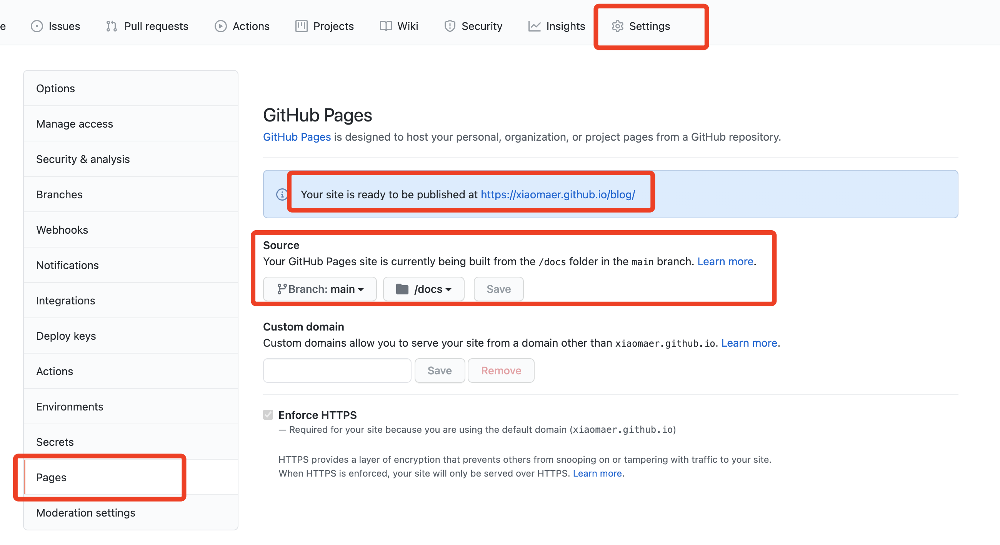

# 基于Docsify和Github Page快速搭建文档网站

本文简单介绍，如何基于Docsify和Github Page快速搭建自己的文档网站

## 前提
* 全局安装 docsify-cli 工具，可以方便地创建及在本地预览生成的文档。
    ```
    npm i docsify-cli -g
    ```
* 创建文档项目目录
  ```
  mkdir blog
  cd blog
  ```
* 初始化项目
  ```
  docsify init ./docs
  ```
  初始化成功后，可以看到 ./docs 目录下创建的几个文件
    - index.html 入口文件
    - README.md 会做为主页内容渲染
    - .nojekyll 用于阻止 GitHub Pages 忽略掉下划线开头的文件

* 本地预览
  ```
  docsify serve docs
  ```
  通过运行 docsify serve 启动一个本地服务器，可以方便地实时预览效果。默认访问地址 http://localhost:3000 。
  
## 基本配置
在 index.html 中增加相关配置。
### 定制侧边栏
* 首先配置 loadSidebar 选项，代码如下：
    ```
    <!-- index.html -->

    <script>
    window.$docsify = {
        loadSidebar: true
    }
    </script>
    <script src="//cdn.jsdelivr.net/npm/docsify/lib/docsify.min.js"></script>
    ```
* 接着创建 _sidebar.md 文件，内容如下
  ```
    <!-- docs/_sidebar.md -->
    * 主标题
        * [副标题1](副标题1.md)
        * [副标题2](副标题2.md)
  ```
* 同时在 docs 中新建 副标题1.md 和 副标题2.md 两个个 Markdown 文件，可以在 副标题1.md 中写入如下，查看效果
  ```
    #  副标题1
    ## 测试
    哈哈哈哈

    ## 测试
    
  ```
### 显示目录
自定义侧边栏同时也可以开启目录功能。设置 subMaxLevel 配置项
```
<!-- index.html -->

<script>
  window.$docsify = {
    loadSidebar: true,
    subMaxLevel: 2
  }
</script>
<script src="//cdn.jsdelivr.net/npm/docsify/lib/docsify.min.js"></script>
```
### 自定义顶部导航栏
首先配置 loadNavbar，默认加载的文件为 _navbar.md
```
    <!-- index.html -->

    <script>
    window.$docsify = {
        loadNavbar: true
    }
    </script>
    <script src="//cdn.jsdelivr.net/npm/docsify/lib/docsify.min.js"></script>
```
```
    <!-- _navbar.md -->

    * [En](/)
    * [中文](/zh-cn/)
```

### 封面
通过设置 coverpage 参数，可以开启渲染封面的功能。封面的生成同样是从 markdown 文件渲染来的。开启渲染封面功能后在文档根目录创建 _coverpage.md 文件。渲染效果如本文档。
```
<!-- index.html -->

<script>
  window.$docsify = {
    coverpage: true
  }
</script>
<script src="//cdn.jsdelivr.net/npm/docsify/lib/docsify.min.js"></script>
```
```
<!-- _coverpage.md -->


# docsify <small>3.5</small>

> 一个神奇的文档网站生成器。

- 简单、轻便 (压缩后 ~21kB)
- 无需生成 html 文件
- 众多主题

[GitHub](https://github.com/docsifyjs/docsify/)
[Get Started](#docsify)
```
### 更多配置
[点击这里](https://docsify.js.org/#/zh-cn/configuration)了解更多配置

## 相关插件
### 全文搜索 - Search
全文搜索插件会根据当前页面上的超链接获取文档内容，在 localStorage 内建立文档索引。默认过期时间为一天，当然我们可以自己指定需要缓存的文件列表或者配置过期时间。
```
<script>
  window.$docsify = {
    search: 'auto', // 默认值

    search : [
      '/',            // => /README.md
      '/guide',       // => /guide.md
      '/get-started', // => /get-started.md
      '/zh-cn/',      // => /zh-cn/README.md
    ],

    // 完整配置参数
    search: {
      maxAge: 86400000, // 过期时间，单位毫秒，默认一天
      paths: [], // or 'auto'
      placeholder: 'Type to search',

      // 支持本地化
      placeholder: {
        '/zh-cn/': '搜索',
        '/': 'Type to search'
      },

      noData: 'No Results!',

      // 支持本地化
      noData: {
        '/zh-cn/': '找不到结果',
        '/': 'No Results'
      },

      // 搜索标题的最大层级, 1 - 6
      depth: 2,

      hideOtherSidebarContent: false, // 是否隐藏其他侧边栏内容

      // 避免搜索索引冲突
      // 同一域下的多个网站之间
      namespace: 'website-1',

      // 使用不同的索引作为路径前缀（namespaces）
      // 注意：仅适用于 paths: 'auto' 模式
      //
      // 初始化索引时，我们从侧边栏查找第一个路径
      // 如果它与列表中的前缀匹配，我们将切换到相应的索引
      pathNamespaces: ['/zh-cn', '/ru-ru', '/ru-ru/v1'],

      // 您可以提供一个正则表达式来匹配前缀。在这种情况下，
      // 匹配到的字符串将被用来识别索引
      pathNamespaces: /^(\/(zh-cn|ru-ru))?(\/(v1|v2))?/
    }
  }
</script>
<script src="//cdn.jsdelivr.net/npm/docsify/lib/docsify.min.js"></script>
<script src="//cdn.jsdelivr.net/npm/docsify/lib/plugins/search.min.js"></script>
```
### 图片缩放 - Zoom image
Medium's 风格的图片缩放插件. 基于 medium-zoom。
```
<script src="//cdn.jsdelivr.net/npm/docsify/lib/plugins/zoom-image.min.js"></script>
```

### Gitalk
一个现代化的，基于Preact和Github Issue的评论系统。
```
<link rel="stylesheet" href="//cdn.jsdelivr.net/npm/gitalk/dist/gitalk.css">

<script src="//cdn.jsdelivr.net/npm/docsify/lib/plugins/gitalk.min.js"></script>
<script src="//cdn.jsdelivr.net/npm/gitalk/dist/gitalk.min.js"></script>
<script>
  const gitalk = new Gitalk({
    clientID: 'Github Application Client ID',
    clientSecret: 'Github Application Client Secret',
    repo: 'Github repo',
    owner: 'Github repo owner',
    admin: ['Github repo collaborators, only these guys can initialize github issues'],
    // facebook-like distraction free mode
    distractionFreeMode: false
  })
</script>
```
### 更多插件

 [点击这里](https://docsify.js.org/#/zh-cn/plugins)查看了解更多插件

## 基于GitHub Pages部署
把代码push到github，然后通过setting-pages，找到 GitHub Pages，选择 main 和 docs 文件夹，点击 save，即部署完成，如下图所示：



## 参考
* docsify官网：https://docsify.js.org/#/zh-cn/