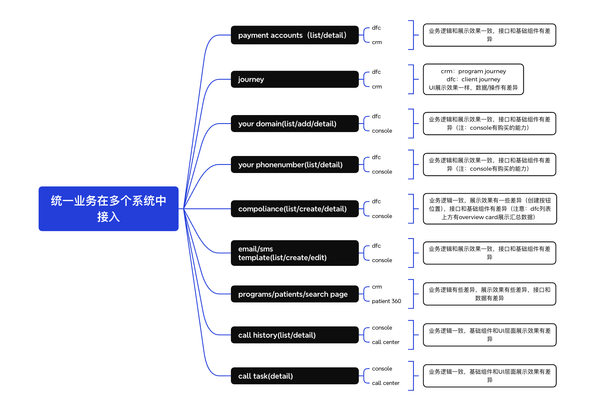

# 多系统业务复用与 UI 适配解决方案-落地版

## 1. 背景


同一套业务需要接入多个系统，通常会遇到几个核心差异点：

- `UI 差异`
  - 需要内置一套标准实现（基于 `@heyrevia/ui-kit`），保证开箱即用
  - 不同系统又需要支持主题覆盖、基础组件替换、局部替换，甚至整页重写
- `业务逻辑差异`
  - 不同系统在默认值、校验规则、状态流转、提交流程上可能存在少量差异
- `权限差异`
  - 不同系统的页面入口、按钮可见性、操作执行规则可能不同
- `API差异`
  - 不同系统的接口可能不同，包括入参数、返回值

在 `Next.js + TypeScript + Tailwind CSS` 技术栈下，目标不是做一套“写死”的公共页面，而是沉淀一套既能复用业务逻辑，又能适配不同系统差异的前端方案。


## 2. 设计目标

- 业务逻辑如何只维护一份
- 业务逻辑有少量差异时，如何在复用主干流程的同时承接变化
- 标准 UI 如何提供默认实现并允许替换和定制
- 权限差异如何做到统一接入而不污染组件代码
- API差异如何抹平

## 3. 设计原则

- `逻辑与表现分离`
  - 业务逻辑、权限判断、数据处理尽量不和具体 DOM 结构耦合
- `主干复用，差异策略化`
  - 公共层沉淀稳定主流程，系统差异通过配置、策略和工作流注入，不在公共逻辑中散落系统分支
- `默认实现优先`
  - 公共模块先提供标准 UI，降低接入成本
- `插件化扩展`
  - 对局部或整体差异，通过扩展点、配置和 Provider 注入，不在公共代码中堆大量系统判断
- `权限集中治理`
  - 权限不只控制按钮展示，还要覆盖页面入口和请求执行
- `适配 Next.js 边界`
  - 服务端负责获取用户与权限快照，客户端负责交互与展示控制

## 4. 需求背景面临的问题

### 4.1 UI 差异不仅是“换皮”

UI 差异通常会出现在四个层级：

- `主题层`
  - 颜色、圆角、阴影、字号、间距不同
- `基础组件层`
  - 不同系统希望替换默认基础组件，或者直接接入自己的 `@heyrevia/ui-kit`
- `局部区域层`
  - 只想替换搜索区、操作区、表格列、空态、弹窗底部等局部节点
- `页面结构层`
  - 页面整体流程一致，但布局结构、交互节奏、信息密度不同，甚至需要整页重写

如果每个系统都复制一份页面再改，会导致业务逻辑、样式和交互逐步分叉，最终公共模块失去复用价值。

### 4.2 权限差异不只影响按钮显示

权限差异至少会影响三层：

- `页面入口`
  - 能否进入页面、路由、模块
- `展示控制`
  - 按钮、菜单、Tab、批量操作是否可见
- `操作执行`
  - 提交、删除、导出等动作在执行时是否允许

如果把权限判断散落在页面和组件内部，会带来两个问题：

- 同一权限规则在多个地方重复实现
- 公共组件被系统差异污染，出现大量 `if (system === 'A')`

### 4.3 API 差异会直接污染业务层

API 差异通常不只是接口地址不同，还包括：

- `请求差异`
  - 入参字段名、嵌套结构、分页格式、排序规则不同
- `响应差异`
  - 返回值字段、枚举值、状态码语义、错误结构不同
- `接口编排差异`
  - 某些系统是单接口完成，某些系统需要多接口预查询、预校验、再提交

如果页面组件直接消费各系统的原始 DTO，就会导致：

- 页面里充斥字段兼容和数据转换逻辑
- 一旦接口变化，需要全量排查页面而不是只改适配层

### 4.4 业务逻辑有少量差异时，最容易把公共层带偏

很多场景里，业务主干流程是一致的，但会存在一些系统级的小差异，例如：

- `规则差异`
  - 必填项不同、默认值不同、某些字段只在特定系统生效
- `状态差异`
  - 某些系统在草稿可编辑，某些系统在待审核也允许补充修改
- `流程差异`
  - 某些系统提交前需要预校验，某些系统提交后还要自动触发补充动作

如果这些差异直接写在页面组件或公共 Hook 内部，会带来几个问题：

- 公共主流程会逐渐堆满 `if/else`
- 系统越多，业务分支越多，最终难以测试和维护
- 新系统接入时，无法判断应该扩展哪里，只能继续复制逻辑

所以这类差异不能靠“复制一份再改”，而要有明确的策略承接层。

### 4.5 多系统长期演进后，维护成本会快速上升

当系统数量增加后，真正的难点不再是“能不能接入”，而是：

- 公共逻辑是否还能只维护一份
- 默认 UI 和系统定制能否共存
- 各系统是否只需要维护自己的适配层
- 新系统接入时，是否还能沿用既有扩展机制

所以落地方案必须同时解决 `复用效率`、`系统差异` 和 `长期可维护性`。

## 5. 有哪些解决方案

### 5.1 UI 差异的解决方案

#### 方案一：Theme Token + Tailwind

如果差异主要是颜色、圆角、阴影、字号、间距，优先用设计 token 解决，而不是重写组件。

- 通过 `CSS Variables` 定义主题变量
- 在 `Tailwind` 中映射成统一 token
- 公共组件只消费 token，不写死品牌样式

适用场景：

- 不同系统只是品牌风格不同
- 组件结构基本一致

#### 方案二：Component Registry / Factory

如果不同系统希望替换基础组件，可以通过注册表或 Provider 注入方式，替换默认的按钮、输入框、弹窗等组件。

- 公共模块提供默认实现
- 系统侧通过 `registry` 注入自己的基础组件
- 默认组件可以基于 `@heyrevia/ui-kit`，也允许系统替换为自己的实现

适用场景：

- 需要全局替换基础组件
- 希望替换组件但不改业务页面结构

#### 方案三：Slot / Render Props

如果只想替换局部区域，不需要整页重写，可以通过具名插槽或渲染函数开放扩展点。

- 页面骨架和流程由公共模块维护
- 搜索区、操作区、表格列、底部操作栏等支持局部覆盖
- 未覆盖部分继续使用默认实现

适用场景：

- 页面整体结构一致
- 只是在局部区域有明显差异

#### 方案四：Headless Page + Logic Hook

如果不同系统页面结构差异很大，就不要强行复用页面结构，而是只复用业务逻辑。

- 公共模块沉淀 `hook`、数据处理、状态流转、校验逻辑
- 系统页面自己决定布局、视觉和交互
- 默认页面只是其中一个可选实现

适用场景：

- 页面需要大改
- 只希望复用业务逻辑和流程能力

#### UI 差异推荐落地方式

推荐按替换粒度从小到大分层处理：

- `Theme Token`
  - 解决视觉风格差异
- `Component Registry`
  - 解决基础组件替换
- `Slot / Render Props`
  - 解决局部结构差异
- `Headless Hook`
  - 解决整页重写场景

这样能避免一开始就走“整页复制”的高成本路线。

### 5.2 权限差异的解决方案

#### 方案一：Strategy Pattern + Provider

先抽象统一权限契约，再由不同系统提供各自实现。

```ts
export type PermissionInput = {
  action: string
  resource: string
  data?: unknown
}

export interface PermissionPolicy {
  can(input: PermissionInput): boolean
}
```

```tsx
const PermissionContext = createContext<PermissionPolicy | null>(null)

export function BizProvider({
  permission,
  children,
}: {
  permission: PermissionPolicy
  children: React.ReactNode
}) {
  return (
    <PermissionContext.Provider value={permission}>
      {children}
    </PermissionContext.Provider>
  )
}
```

这样公共组件只关心“是否有权限”，不关心“系统 A 和系统 B 的权限规则到底有什么差异”。

#### 方案二：三层权限控制

权限不要只做按钮隐藏，建议至少覆盖三层：

- `页面入口层`
  - 控制页面、路由、模块可访问性
- `展示控制层`
  - 控制按钮、菜单、Tab、批量操作入口
- `执行校验层`
  - 在提交、删除、导出等关键动作前再次校验

真正的安全边界仍然应该放在服务端。

#### 方案三：Next.js 服务端权限快照

在 `Next.js` 场景下，推荐把权限数据拆成两部分：

- `服务端`
  - 获取用户身份、系统标识、权限快照，决定页面是否可进入
- `客户端`
  - 基于权限快照控制展示态和交互态

这样既符合 `Next.js` 的边界，也能避免把复杂权限对象直接透传到客户端。

### 5.3 API 差异的解决方案

#### 方案一：统一领域契约 + Adapter Layer

这是前端最推荐的默认方案。

- 在 `biz-core` 中定义统一领域模型、入参模型、服务接口
- 各系统在自己的 `adapter` 中实现接口
- 适配层负责把系统 API DTO 转为统一领域模型

```ts
export type Order = {
  id: string
  status: 'draft' | 'submitted'
  amount: number
}

export type SubmitOrderInput = {
  id: string
  remark?: string
}

export interface OrderService {
  getDetail(id: string): Promise<Order>
  submit(input: SubmitOrderInput): Promise<void>
}
```

系统 A、系统 B 可以各自实现 `OrderService`，但页面和业务逻辑只依赖统一接口。

#### 方案二：DTO Mapper

如果接口差异主要集中在字段层，可以单独沉淀 DTO 映射器：

- `request mapper`
  - 统一入参转换为各系统接口需要的 payload
- `response mapper`
  - 各系统返回 DTO 转成统一领域模型
- `error mapper`
  - 各系统错误码、错误文案收敛成统一错误语义

适用场景：

- 大部分流程一致
- 主要是字段和返回结构不同

#### 方案三：BFF / Gateway

如果系统间 API 差异非常大，或者需要统一编排多个后端接口，前端适配层会变得很重，这时可以引入 BFF。

- 后端或 BFF 提供统一前端接口
- 前端只面向统一协议开发
- 系统特有编排逻辑放到 BFF 层处理

适用场景：

- 多接口编排复杂
- 安全校验、鉴权、流程编排更适合放服务端

#### 方案四：配置化映射

如果差异比较轻，例如只有少数字段名、接口路径或枚举映射不同，可以引入轻量配置：

- 路径映射
- 字段映射
- 枚举映射

但配置化只适合轻差异，不适合承载复杂业务流程。

#### API 差异推荐落地方式

推荐优先级如下：

- `默认方案`
  - `统一领域契约 + Adapter Layer`
- `轻差异补充`
  - `DTO Mapper / 配置化映射`
- `重差异兜底`
  - `BFF / Gateway`

不建议在页面组件里直接写：

- 当前系统用哪个接口
- 当前系统字段叫什么
- 当前系统返回值怎么兼容

这些都应该收敛到适配层。

### 5.4 业务逻辑差异的解决方案

这类问题的核心不是“复制业务逻辑”，而是 `主干流程共享，差异点策略化`。

#### 方案一：Feature Config

如果差异非常轻，只是开关或枚举层面的变化，可以先用配置化处理。

```ts
export type OrderFeatureConfig = {
  enableDraft: boolean
  requireRemarkOnSubmit: boolean
  defaultSort: 'createdAt' | 'updatedAt'
}
```

适用场景：

- 是否开启草稿
- 是否要求备注
- 某些默认行为不同

优点：

- 成本最低
- 接入简单

缺点：

- 只适合静态、轻量差异
- 不适合承载复杂规则和流程

#### 方案二：Business Policy

如果差异主要体现在业务规则层，推荐抽出统一策略接口，由系统侧注入实现。

```ts
export type OrderPolicy = {
  canEdit?(ctx: OrderContext): boolean
  getDefaultValue?(ctx: OrderContext): Partial<OrderForm>
  validateBeforeSubmit?(ctx: OrderContext): string[]
  buildSubmitInput?(ctx: OrderContext): SubmitOrderInput
}
```

公共 Use Case 只依赖策略契约，不直接感知系统标识。

适用场景：

- 默认值不同
- 校验规则不同
- 某些状态下的可操作性不同

优点：

- 差异边界清晰
- 规则复用性高

缺点：

- 需要提前设计稳定契约

#### 方案三：Workflow Strategy

如果差异已经进入流程层，例如提交前后多了一两步动作，就不要只靠配置或规则判断，应该抽成工作流策略。

```ts
export interface SubmitWorkflow {
  run(ctx: OrderContext, service: OrderService): Promise<void>
}
```

例如：

- 系统 A：直接提交
- 系统 B：预校验 -> 保存草稿 -> 正式提交
- 系统 C：提交成功后自动触发补充同步

适用场景：

- 主流程一致，但前后步骤不同
- 不同系统需要定制提交流程

优点：

- 能显式表达流程差异
- 不会把公共主流程改成一棵条件分支树

缺点：

- 设计不当时可能让工作流过于分散

#### 方案四：差异过大时拆 Feature

如果差异已经不是“有些许不同”，而是状态机、关键节点、领域语义都变了，就不要强行复用同一套 Use Case。

这时更合理的做法是：

- 拆成两个独立 Feature
- 共享底层领域模型、服务接口、基础组件
- 不再共享整条业务流程

这比在公共逻辑里持续堆系统判断更可维护。

#### 业务逻辑差异推荐落地方式

推荐按差异程度分层处理：

- `轻差异`
  - 用 `Feature Config`
- `规则差异`
  - 用 `Business Policy`
- `流程差异`
  - 用 `Workflow Strategy`
- `重差异`
  - 直接拆 `Feature`

判断标准可以简单归纳为：

- 只是开关、默认值、少量规则不同
  - 不要拆流程，优先用配置或策略
- 提交前后步骤不同
  - 抽工作流
- 主状态机和业务节点已经不同
  - 不要硬复用

### 5.5 工程组织的解决方案

要让上述能力长期可维护，工程边界也需要一起设计。

推荐采用：

- `Monorepo + Component Library`

职责划分建议如下：

- `biz-core`
  - 业务逻辑、领域模型、服务接口、权限契约、业务策略契约、工作流契约
- `biz-ui`
  - 默认 UI、页面骨架、扩展点、Provider
- `apps/system-*`
  - 系统主题、权限实现、API 适配、业务策略实现、工作流实现、组件替换

## 6. 推荐落地组合

如果目标是“默认实现可直接用，同时允许不同系统按需定制”，推荐采用下面这套组合：

| 问题 | 推荐解法 |
| --- | --- |
| 业务逻辑复用 | `Use Case / Hook + biz-core` |
| 业务逻辑差异 | `Feature Config / Business Policy / Workflow Strategy` |
| 默认 UI 提供 | `biz-ui` 内置标准页面和标准组件 |
| 视觉差异 | `Theme Token + Tailwind` |
| 基础组件替换 | `Component Registry / Provider` |
| 局部结构差异 | `Slot / Render Props` |
| 整页重写 | `Headless Page + Logic Hook` |
| 权限差异 | `Strategy Pattern + Provider + 三层权限控制` |
| API差异 | `统一领域契约 + Adapter Layer`，必要时引入 `BFF` |
| 工程治理 | `Monorepo + 分层包结构` |

这套组合的核心思想是：

- 公共模块只负责沉淀稳定能力
- 系统差异全部收敛到自己的适配层
- 公共主流程保持稳定，局部业务差异通过策略和工作流承接
- 优先做“可扩展的默认实现”，而不是“每个系统复制一份”

## 7. 参考落地结构

```text
packages/
  biz-core/
    src/
      api/
      services/
      usecases/
      policies/
      workflows/
      permissions/
      hooks/
      types/

  biz-ui/
    src/
      components/
      pages/
      slots/
      registry/
      providers/
      theme/

apps/
  system-a/
    app/
    src/
      biz-adapter/
        api/
        policies/
        workflows/
        permission.ts
        registry.tsx
        theme.css
        config.ts

  system-b/
    app/
    src/
      biz-adapter/
        api/
        policies/
        workflows/
        permission.ts
        registry.tsx
        theme.css
        config.ts
```

各层职责如下：

- `biz-core`
  - 只放与系统无关的业务能力和稳定契约
- `biz-ui`
  - 只放默认 UI 和扩展机制
- `biz-adapter`
  - 只放系统定制内容，包括 API、权限、业务策略和工作流，不反向污染公共模块

### 7.1 `biz-core/src` 各目录职责

- `api/`
  - 放公共请求基础能力，例如请求封装、通用错误处理、BFF Client、接口调用基类；不放系统特有字段映射
- `services/`
  - 放领域 Service 契约和默认 Facade，作为 `usecases` 的依赖入口，屏蔽底层调用细节
- `usecases/`
  - 放主干业务流程编排，例如查询详情、保存、提交、撤回等稳定 Use Case
- `policies/`
  - 放业务规则契约和默认实现，例如默认值生成、可编辑规则、提交流程前校验
- `workflows/`
  - 放流程类契约和默认工作流，用于承接“提交前后多一步”的差异
- `permissions/`
  - 放权限模型、权限契约、权限快照和公共权限判断工具
- `hooks/`
  - 放面向 UI 的 Headless Hook 或 Controller Hook，把 `usecases`、`policies`、`workflows` 组装成页面可消费的数据和行为
- `types/`
  - 放领域模型、表单模型、服务入参出参、通用类型定义

### 7.2 `biz-ui/src` 各目录职责

- `components/`
  - 放默认基础组件和通用业务组件，例如按钮、表单项、列表、弹窗、空态等
- `pages/`
  - 放默认页面和页面骨架组件，承接标准布局、交互结构和默认页面实现
- `slots/`
  - 放页面级或区域级扩展点定义，例如 Header、Search、ActionBar、Footer 的 Slot 类型和默认实现
- `registry/`
  - 放组件注册表、工厂函数和替换机制，用于系统侧注入自己的基础组件实现
- `providers/`
  - 放运行时上下文 Provider，例如权限 Provider、运行时配置 Provider、组件注册表 Provider
- `theme/`
  - 放主题 Token、CSS Variables、Tailwind 映射和默认主题样式

### 7.3 `apps/system-*/src/biz-adapter` 各目录职责

- `api/`
  - 放当前系统的 API Adapter、DTO Mapper、接口编排逻辑，把系统接口转换为 `biz-core` 约定的服务契约
- `policies/`
  - 放当前系统的业务规则实现，例如编辑规则、字段默认值、校验规则
- `workflows/`
  - 放当前系统的流程实现，例如预校验、保存草稿、正式提交、提交后同步
- `permission.ts`
  - 放当前系统的权限策略实现，把系统权限模型适配为统一权限契约
- `registry.tsx`
  - 放当前系统的组件替换注册，例如替换按钮、输入框、弹窗
- `theme.css`
  - 放当前系统的主题变量和样式覆盖
- `config.ts`
  - 放当前系统的轻量配置，例如功能开关、默认行为、枚举映射

### 7.4 目录边界建议

- `biz-core/src`
  - 只沉淀跨系统稳定复用的能力，不出现系统标识判断
- `biz-ui/src`
  - 只负责默认 UI 和扩展机制，不承接系统特有业务规则
- `apps/system-*/src/biz-adapter`
  - 只承接系统差异，不反向修改公共契约

这样划分后，新增系统时通常只需要新增一套 `biz-adapter` 实现，而不需要复制 `biz-core` 和 `biz-ui`。

## 8. 建议落地顺序

### 第一步：先抽契约

优先抽出四类契约：

- 领域模型
- 服务接口
- 权限接口
- 业务策略和工作流接口

### 第二步：沉淀默认实现

在 `biz-core` 和 `biz-ui` 中分别提供默认实现：

- 默认业务策略和默认工作流实现
- 默认页面
- 默认基础组件
- 插槽和注册表能力

### 第三步：系统侧接入适配层

每个系统只做四件事：

- 提供主题
- 提供权限实现
- 提供 API Adapter
- 提供业务策略、工作流实现和必要的组件替换

### 第四步：按页面逐步迁移

不要一次性整体重写，优先挑选：

- 业务流程稳定
- 复用收益高
- 差异边界清晰

的页面先试点。

## 9. 不建议的做法

- 每个系统复制一份页面代码，再各自维护
- 在公共组件中写大量系统判断
- 在公共 Use Case 或 Hook 中直接判断系统标识处理业务规则
- 把权限控制简化为“按钮隐藏”
- 在页面中直接消费各系统原始 API DTO
- 一上来就用整页重写解决所有差异

这些做法短期快，但后续会快速失控。

## 10. 总结

这类场景的关键，不是“选一个万能方案”，而是按差异层级组合方案：

- `UI 差异`
  - 用 `Theme Token + Registry + Slot + Headless`
- `业务逻辑差异`
  - 用 `Feature Config + Business Policy + Workflow Strategy`
- `权限差异`
  - 用 `Strategy Pattern + Provider + 三层权限控制`
- `API差异`
  - 用 `统一领域契约 + Adapter Layer`，必要时引入 `BFF`
- `工程治理`
  - 用 `Monorepo + biz-core / biz-ui / biz-adapter` 分层

这样才能做到：

- 业务逻辑只维护一份
- 少量业务差异不会演变成公共逻辑分叉
- 默认实现可直接复用
- 系统差异有明确承接边界
- 后续新增系统时仍能继续扩展

## 11. 配套样板代码

为了避免当前文档过长，完整样板代码单独放在一份配套文档中：

- [多系统业务复用与 UI 适配解决方案-样板代码](./多系统业务复用与 UI 适配解决方案-样板代码.md)

样板代码覆盖了以下内容：

- `biz-core`
  - 领域模型、权限契约、服务契约、业务策略、工作流、共享 Hook
- `biz-ui`
  - Runtime Provider、组件注册表、默认页面、Slot 扩展点
- `system-a`
  - 默认实现较多，采用直接提交工作流
- `system-b`
  - 业务规则和提交流程有差异，采用预校验 + 提交 + 同步工作流

如果要直接在项目里落地，建议先按样板代码里的 `订单详情` 场景试点，再逐步扩展到其他业务页面。
